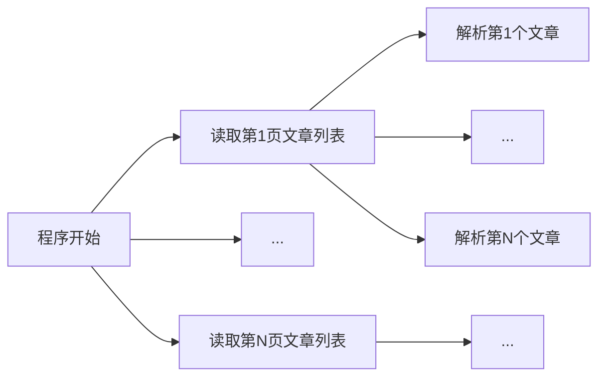

+++
title = 'DFS实现Bilibili视频评论爬虫'
date = 2021-11-15T01:29:43+08:00
draft = true
+++

> 这篇文章写的很烂，但它是我第一个相对正式且具备一定代码量的 golang 项目，我保留它

west2-online golang组的11月考核有一个提高任务，是爬取何同学某一个视频的评论并且使用mysql储存，这里单独写一篇文章来记录编写过程中的一些事

## 相关API

使用Porxyman抓包后，可以轻松拿到两个API：

主评论：

`https://api.bilibili.com/x/v2/reply/main?jsonp=jsonp&next=【pages】&type=1&oid=【OID】&mode=【mode】&plat=1&_=【timestamp】`

楼中楼：

`https://api.bilibili.com/x/v2/reply/reply?&jsonp=jsonp&pn=【pages】&type=1&oid=【OID】&ps=【num】&root=【父评论ID】&_=【timestamp】`

跟大多数网站的api一样，这个timestamp可以不提交，毕竟核查时间戳很浪费资源，但是bilibili并不是完全没有审查请求，它会在请求过多的时候拒绝返回数据（返回错误码-412），这个频率测试下来是不能小于0.5秒

这里的pages对应b站显示评论的一个机制，b站在下拉读取评论的过程中**只会十条十条的读取**，也就是说你拉到底部它才会继续加载更多的评论，不会一口气把评论都读完，而子评论也是如此，但是子评论有个更灵活的ps参数，你可以控制它返回多少子评论，但也有个上限，**最多返回20条**，其他就得“翻页”了

## 爬虫逻辑

当爬虫爬取了一条评论后，爬虫会穷尽这条评论下的所有子评论后，才会继续读取下一条评论，而主评论的排序方式以热门程度为序，b站对返回评论有三种模式，也就是主评论API中的mode参数，1=评论，2=最新评论，3=热门评论，因此程序会逐渐爬完所有的评论，并存进数据库

## 数据库结构

以BV作为每个表的ID，rpid作为主键

| rpid   | mid    | root     | parent   | rcount   | ctime  | like   | uname | message |
| ------ | ------ | -------- | -------- | -------- | ------ | ------ | ----- | ------- |
| 评论ID | 用户ID | 根评论ID | 父评论ID | 子楼个数 | 时间戳 | 点赞数 | 昵称  | 内容    |

## 代码实现

```go
package main

import (
	"database/sql"
	"fmt"
	"io/ioutil"
	"net/http"
	"strconv"
	"strings"
	"time"

	_ "github.com/go-sql-driver/mysql"
	"github.com/jsonparser"
)

/*
思路：
获取到b站评论api以后，主要的内容其实就是对json进行文本操作了，整个过程是递推过程
唯一使用goroutine的地方是向数据库提交数据，其余均不能使用goroutine，b站服务器会检测频率

会导致程序运行停止的地方：
1.连接数据库时连接失败
2.提交数据时数据库返回错误结果亦或是提交失败，避免浪费资源
3.关闭数据库时关闭失败

正常进行程序就已经会导致被服务器临时ban，解决方法是强行放慢进度
目前是在主评论之间加1秒间隔，子评论之间加0.5秒间隔

*/

const (
	userName = "username"
	passWord = "password"
	ip       = "database-ip"
	port           = "port"
	dbName         = "dbname"
	bv             = "bv1f4411m7qc"
	oid            = "54737593"
	api_main       = "https://api.bilibili.com/x/v2/reply/main?jsonp=jsonp&next=[page]&type=1&oid=[oid]&mode=3&plat=1&_[timestamp]"      //爬取评论API
	api_son        = "https://api.bilibili.com/x/v2/reply/reply?&jsonp=jsonp&pn=[page]&type=1&oid=[oid]&ps=20&root=[root]&_=[timestamp]" //爬取楼中楼API
	maxWorkerCount = 64
)

type commentInfo struct {
	rpid    int64  //评论ID
	mid     int64  //用户ID
	root    int64  //根楼
	parent  int64  //父楼
	rcount  int64  //有效楼中楼数量
	ctime   int64  //11位时间戳
	like    int64  //点赞人数
	uname   string //昵称
	message string //评论内容
	//我之前一直在想，为什么b站评论没有显示不喜欢的人数，没想到是数据库压根没存，还是api读取的时候不返回？
}

var db *sql.DB
var code int64

var workerCount = 0
var solveRequest = make(chan commentInfo)
var workerDone = make(chan bool)
var doneCounter = 0
var haveSolved = false
var start time.Time

func waitForWorkers() {
	for {
		select {
		case info := <-solveRequest:
			workerCount++
			go SubmitInfo(info, true)
		case <-workerDone:
			workerCount--
			doneCounter++
			fmt.Printf("\r已处理任务数量：%v", strconv.Itoa(doneCounter))
			if workerCount == 0 && haveSolved {
				if code == -412 {
					fmt.Printf("\n\n程序异常结束：服务器拒绝访问")
				} else {
					fmt.Println("\n\n程序执行完毕 耗时：" + timeSolve(time.Since(start).String()))
				}
				return
			}
		}
	}
}

func timeSolve(time string) string {
	keepNum := 2                            //规划保留的小数点后位数
	dotIndex := strings.IndexAny(time, ".") //获取小数点所在的索引值
	return time[:dotIndex+keepNum+1] + "s"
}

func InitDB() bool { //连接RDS
	path := strings.Join([]string{userName, ":", passWord, "@tcp(", ip, ":", port, ")/", dbName, "?charset=utf8&parseTime=True"}, "")
	db, _ = sql.Open("mysql", path)
	db.SetConnMaxLifetime(100)
	db.SetMaxIdleConns(10)
	if err := db.Ping(); err != nil {
		panic(err)
		return false
	}
	return true
}

func SubmitInfo(info commentInfo, a bool) { //提交数据 true=使用goroutine
	tx, err := db.Begin()
	//panic(err)
	if err != nil {
		panic(err)
		return
	}
	cmd := "INSERT INTO `" + dbName + "`.`" + bv + "` (`rpid`,`mid`,`root`,`parent`,`rcount`,`ctime`,`like`,`uname`,`message`) VALUES (?, ?, ?, ?, ?, ?, ?, ?, ?)"
	tmp, err := tx.Prepare(cmd)
	if err != nil {
		panic(err)
		return
	}
	_, err = tmp.Exec(info.rpid, info.mid, info.root, info.parent, info.rcount, info.ctime, info.like, info.uname, info.message)
	if err == nil {
		tx.Commit()
	}
	if a {
		workerDone <- true
	} else {
		doneCounter++
	}
	return

}

func solveCommentProgress(data []byte, dataType jsonparser.ValueType, offset int, err error) { //处理评论
	var info commentInfo
	if err != nil {
		panic(err)
		return
	}
	if dataType == jsonparser.Object { //数据类型正确，开始读取
		info.rpid, _ = jsonparser.GetInt(data, "rpid")
		info.mid, _ = jsonparser.GetInt(data, "mid")
		info.root, _ = jsonparser.GetInt(data, "root")
		info.parent, _ = jsonparser.GetInt(data, "parent")
		info.rcount, _ = jsonparser.GetInt(data, "rcount")
		info.ctime, _ = jsonparser.GetInt(data, "ctime")
		info.like, _ = jsonparser.GetInt(data, "like")
		info.uname, _ = jsonparser.GetString(data, "member", "uname")
		info.message, _ = jsonparser.GetString(data, "content", "message")
		if workerCount < maxWorkerCount {
			solveRequest <- info
		} else {
			SubmitInfo(info, false)
		}
		//楼中楼判断
		_, tmp, _, _ := jsonparser.Get(data, "replies")
		if tmp == jsonparser.Array {
			sonProgress(info.rpid, oid)
		}
	}
}

func getCommentData(url string) bool { //获取并开始处理json
	//构建请求
	req, err := http.NewRequest("GET", url, nil) //这个api对头文件检查不严格，实际上下面三个完全不需要
	req.Header.Add("User-Agent", "Mozilla/5.0 (Macintosh; Intel Mac OS X 10_15_7) AppleWebKit/537.36 (KHTML, like Gecko) Chrome/95.0.4638.69 Safari/537.36")
	req.Header.Add("Referer", "https://www.bilibili.com/")
	req.Header.Add("Content-Type", "application/json")
	if err != nil {
		return false
	}
	//发送请求
	resp, err := http.DefaultTransport.RoundTrip(req) // 关闭自动重定向
	if err != nil {
		return false
	}
	//提取data内容
	re, err := ioutil.ReadAll(resp.Body)
	resp.Body.Close()
	if err != nil {
		return false
	}
	code, err = jsonparser.GetInt(re, "code")
	if code == -412 { //请求过多，暂时不提供数据
		return false
	}
	result, tmp, _, err := jsonparser.Get(re, "data")
	if err != nil {
		return true
	}
	_, tmp, _, _ = jsonparser.Get(result, "replies")
	if tmp == jsonparser.Array { //存在则进行评论处理
		_, _ = jsonparser.ArrayEach(result, solveCommentProgress, "replies")
	}
	return true
}

func mainProgress() { //处理主评论
	if InitDB() {
		fmt.Println("数据库连接成功\n")
		defer endProgress()
	} else {
		fmt.Println("数据库连接失败\n")
		return
	}

	start = time.Now()
	var tmp int = 1
	for {
		//地址预处理
		url := strings.ReplaceAll(api_main, "[oid]", oid)
		url = strings.ReplaceAll(url, "[page]", strconv.Itoa(tmp))
		url = strings.ReplaceAll(url, "[timestamp]", strconv.FormatInt(time.Now().UnixMilli(), 10))
		if !getCommentData(url) || code == -412 {
			break
		} else {
			tmp++
		}
		time.Sleep(time.Second)
	}
	haveSolved = true
}

func sonProgress(root int64, oid string) { //处理子评论
	var tmp int = 1
	for {
		//地址预处理
		url := strings.ReplaceAll(api_son, "[oid]", oid)
		url = strings.ReplaceAll(url, "[root]", strconv.FormatInt(root, 10))
		url = strings.ReplaceAll(url, "[page]", strconv.Itoa(tmp))
		url = strings.ReplaceAll(url, "[timestamp]", strconv.FormatInt(time.Now().UnixMilli(), 10))
		if !getCommentData(url) || code == -412 {
			break
		} else {
			tmp++
		}
		time.Sleep(500000000)
	}
}

func endProgress() { //程序结束时处理的内容
	err := db.Close() //关闭数据库
	if err != nil {
		panic(err)
		return
	}
}

func main() {
	go mainProgress()
	waitForWorkers()
	return
}

```

## 爬取逻辑

在这个程序中，爬虫采用DFS方法，如图，爬虫从上至下，从左至右遍历


